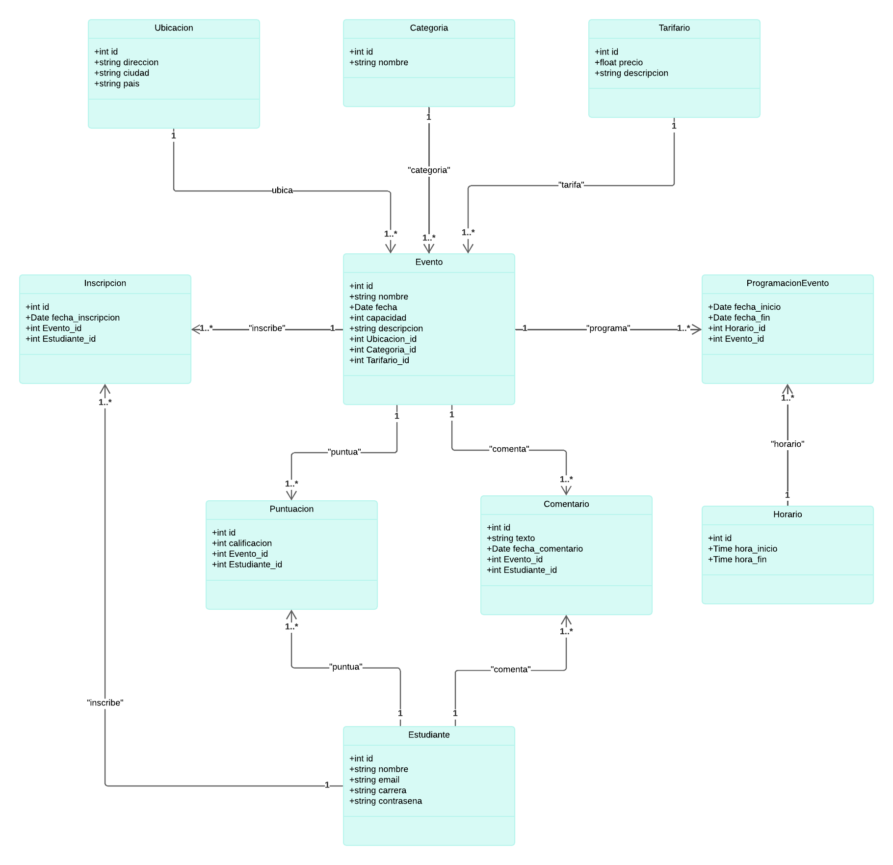
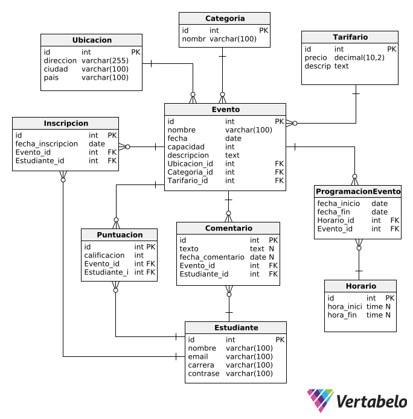

# CampusSphere-API_RESTFull
## Introducción
**CampusSphere** es una aplicacion web con el objetivo de facilitar a los estudiantes inscribirse, visualizar y calificar en eventos universitarios organizados por la universidad. A través de esta plataforma, los alumnos podrán filtrar eventos, marcar eventos que les interesen y recibir notificaciones sobre sus actividades. 
El enfoque de CampusSphere está en mejorar la participación estudiantil y fortalecer la comunidad universitaria, proporcionando un espacio centralizado para gestionar y promover la vida académica y social. 

### Colaboradores del Proyecto
| **Nombre**                        | **Rol**                                     | **Codigo**                                                 |
|-----------------------------------|---------------------------------------------|------------------------------------------------------------|
| Andrés Joshua Rodríguez Guerrero    | Miembro                                  | U202121973           |
| Jeffrey Ulises Diaz Villanueva      | Líder del Proyecto                       | U202124269           |
| Marco Antonio Fuentes Rivera Onofre | Miembro                                  | U20211b693           |
| Willam Alexander Huamán Saavedra    | Miembro                                  | U20211E088           |

### Revisa el Progreso del Proyecto CampusSphere
| **Columna**       | **Descripción**                                                                                                                                    |
|-------------------|----------------------------------------------------------------------------------------------------------------------------------------------------|
| **Backlog**       | Contiene todas las historias de usuario, tareas y características que deben desarrollarse. Es el listado de todo el trabajo pendiente.              |
| **En Progreso**   | Incluye las tareas que están actualmente en desarrollo. Visualiza el trabajo en curso para asegurar el flujo continuo de trabajo.                   |
| **Revisión**      | Después de completar una tarea, se mueve aquí para una revisión de código y revisión por pares (peer review). Esta fase incluye la creación de **pull requests** para asegurar que el código cumpla con los estándares de calidad antes de integrarse al proyecto principal. |
| **En Pruebas**    | Contiene las tareas que han pasado la revisión de código y necesitan pruebas exhaustivas (unitarias, de integración y de aceptación) para garantizar su calidad. |
| **Hecho**         | Las tareas completamente desarrolladas, revisadas y probadas se mueven aquí, indicando que están listas y finalizadas.                               |
Mira cómo va avanzando nuestro trabajo visitando el siguiente enlace: [Tablero de Trello](https://trello.com/b/aChiHt0V/ing-software).

### Funcionalidades de la Aplicación CampusSphere
#### **Módulo de Gestión de Usuarios**
- **Creación de Usuarios e Inicio de Sesión:**
    - Permitir a los usuarios registrarse en la plataforma con roles específicos.
    - Implementación de autenticación y autorización mediante JWT.
    - Protección de recursos de la plataforma según los roles de usuario (admin o student).
    - Funcionalidad para restablecimiento de contraseña a través de correo electrónico.
  
- **Gestión de Cuentas de Usuario:**
    - Crear, editar y eliminar cuentas de usuario.
    - Modificación de la información de la cuenta como nombre, correo electrónico y contraseña.
    - Eliminación de cuentas por parte de los usuarios.

#### **Módulo de Seguridad**

- **Autenticación y Autorización:**
    - Implementación de seguridad con JWT para proteger los recursos de la plataforma.
    - Control de acceso a recursos por roles específicos (admin o student).
    - Configuración de Spring Security para proteger los endpoints sensibles.
    - Restricción de acceso a funcionalidades críticas para los usuarios sin permisos.

#### **Módulo de Pagos**

- **Pago de Inscripciones para Eventos:**
    - Integración con la API de PayPal para pagos seguros.
    - Creación y gestión de órdenes de pago para inscripción a eventos.
    - Verificación del estado de pagos (aprobado, pendiente o fallido).

- **Visualización de Historial de Pagos:**
    - Permitir a los usuarios ver un historial completo de sus transacciones realizadas.
    - Mostrar detalles como fechas y montos de pagos.

#### **Módulo de Gestión de Eventos**

- **Creación y Gestión de Eventos:**
    - Creación de nuevos eventos por parte de los administradores.
    - Edición y eliminación de eventos creados previamente.

- **Inscripción a Eventos:**
    - Permitir a los usuarios inscribirse en eventos a través de una plataforma en línea.
    - Marcar eventos como "Me interesa".

- **Calificación de Eventos:**
    - Permitir a los usuarios calificar eventos en los que participaron, usando una escala de 1 a 5 estrellas.
    - Control de acceso para que solo los usuarios inscritos y asistentes puedan calificar.

#### **Módulo de Notificaciones**

- **Notificaciones por Correo Electrónico:**
    - Envío de notificaciones de inscripción exitosa a eventos.
    - Envío de correos de agradecimiento por calificación de eventos.

- **Restablecimiento de Contraseña:**
    - Implementación del servicio para restablecer contraseñas mediante correo electrónico.
    - Envío de enlaces para restablecer la contraseña de manera segura.

#### **Módulo de Gestión de Programación de Eventos**

- **Creación y Gestión de Programación de Eventos:**
    - Creación de programación con horarios específicos para eventos.
    - Modificación y eliminación de horarios asociados a eventos.
    - Visualización de la programación de eventos en el calendario personal de los usuarios.

- **Reporte de Programación de Eventos:**
    - Generación de reportes detallados sobre la programación de eventos, incluyendo horarios asignados.

#### **Módulo de Calificación**

- **Calificación de Eventos:**
    - Permitir a los usuarios calificar los eventos en los que participaron con una escala de 1 a 5 estrellas.
    - Control de acceso para que solo los usuarios que asistieron puedan calificar.

- **Filtrado de Eventos por Calificación:**
    - Búsqueda de eventos según su calificación promedio.
    - Filtrado dinámico de eventos basados en el número de estrellas otorgadas por otros usuarios.

- **Reporte de Eventos Calificados:**
    - Generación de reportes de eventos calificados, mostrando promedio de calificaciones y número de reseñas.
    - Exportación de reportes de eventos calificados para su análisis.

## Diagramas de la Aplicación

Para entender mejor la estructura y diseño de la aplicación "BookHub", revisa los siguientes diagramas:

### Diagrama de Clases

### Diagrama de Base de Datos

Este diagrama ilustra el esquema de la base de datos utilizada por la aplicación, mostrando las tablas, columnas, y relaciones entre las entidades.

### Descripción de Capas del Proyecto

| capa        | descripción                                                                                  |
|-------------|----------------------------------------------------------------------------------------------|
| api         | Contiene los controladores REST que manejan las solicitudes HTTP y las respuestas.            |
| entity      | Define las entidades del modelo de datos que se mapean a las tablas de la base de datos.      |
| repository  | Proporciona la interfaz para las operaciones CRUD y la interacción con la base de datos.      |
| service     | Declara la lógica de negocio y las operaciones que se realizarán sobre las entidades.         |
| service impl| Implementa la lógica de negocio definida en los servicios, utilizando los repositorios necesarios. |
